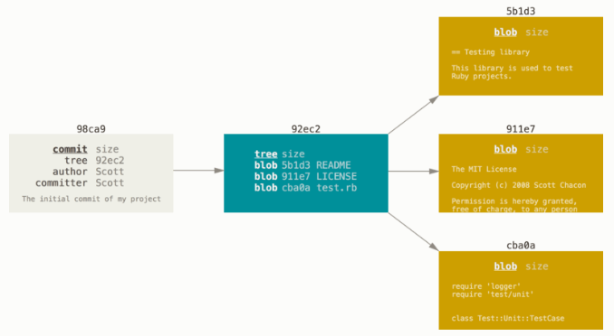
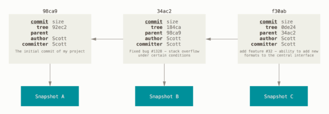

import Tabs from '@theme/Tabs';
import TabItem from '@theme/TabItem';
import BrowserWindow from '@site/src/components/BrowserWindow';

在学习 Git 的过程中，我认为 Git 就是一个工具，对于这个工具的学习始终需要结合真正的实际操作来进行。因此，我并不想将 Git 所有的内容都记录下来，只是记录学习 Git 中了解的一些重点。其余的内容可以在使用时遇到了再进行查询。
- [Git Pro](https://git-scm.com/book/zh/v2) 官方网站上的 Git 教材，有众多例子解释，还有专门的中文翻译文档。

{/* truncate */}

## Git 直接记录快照
Git 和其它版本控制系统（包括 Subversion 和近似工具）的主要差别在于 Git 对待数据的方式。

从概念上来说，其它大部分系统以文件变更列表的方式存储信息，这类系统（CVS、Subversion、Perforce 等等） 将它们存储的信息看作是一组基本文件和每个文件随时间逐步累积的差异（它们通常称作基于差异（delta-based）的版本控制）。

Git 不按照以上方式对待或保存数据。反之，Git 更像是把数据看作是对小型文件系统的一系列快照。在 Git 中，每当你提交更新或保存项目状态时，它基本上就会对当时的全部文件创建一个快照并保存这个快照的索引。为了效率，如果文件没有修改，Git 不再重新存储该文件，而是只保留一个链接指向之前存储的文件。Git 对待数据更像是一个快照流。

## Git 的文件状态
Git 有三种状态，文件可能处于其中之一。

- 已修改（modified）表示修改了文件，但还没保存到数据库中。
- 已暂存（staged）表示对一个已修改文件的当前版本做了标记，使之包含在下次提交的快照中。
- 已提交（committed）表示数据已经安全地保存在本地数据库中。

### 三个阶段
这会让我们的 Git 项目拥有三个阶段：工作区、暂存区以及 Git 仓库目录。

- 工作区：项目的某个版本独立提取出来的内容。这些从 Git 仓库的压缩数据库中提取出来的文件，放在磁盘上供你使用或修改。也就是我们打开 Git 仓库时除了 .git 目录以外的其他内容。

- 暂存区：本质是一个文件（<u>.git/index</u>），保存了下次将要提交的文件列表信息，一般在 Git 仓库目录中。按照 Git 的术语叫做“索引”，不过一般说法还是叫“暂存区”。暂存区并不是真的一个存储了修改的文件的存储区。假如我们将所有暂存的内容全部提交了之后，我们再使用 `git ls-files` 命令，我们依旧能看到暂存区的文件列表。

- Git 仓库目录：Git 用来保存项目的元数据和对象数据库的地方。这是 Git 中最重要的部分，从其它计算机克隆仓库时，复制的就是这里的数据。

### 常见工作流程
我们平常在使用 Git 时，工作流程一般包括但不限于以下几步：

1. 修改工作目录中的内容，或者是删除，添加某些文件
2. 将这些修改暂存
3. 确定好修改完毕之后，将快照永久性地提交至 Git 仓库目录中

<BrowserWindow>
<Tabs>
  <TabItem value="add" label="暂存操作" default>
    暂存背后的操作为：为每一个文件计算校验和（使用 SHA-1 哈希算法），然后会把当前版本的文件快照保存到 Git 仓库中（Git 使用 blob 对象来保存它们），最终将校验和加入到暂存区域等待提交。
  </TabItem>
  <TabItem value="commit" label="提交操作">
    第一次提交：Git 会先计算每一个子目录的校验和， 然后在 Git 仓库中这些校验和保存为树对象。随后，Git 便会创建一个提交对象，它除了包含上面提到的那些信息外，还包含指向这个树对象（项目根目录）的指针。 如此一来，Git 就可以在需要的时候重现此次保存的快照。

    

    后续提交：提交对象除了包含上述内容，还会包含一个指向父对象的指针

    
  </TabItem>
</Tabs>
</BrowserWindow>

### 为什么需要暂存区
我们在进行工作的时候，有时候可能会发现——文件暂存之后就直接提交了。那么为什么需要暂存区呢，直接提交至版本库不就好了吗？

这是因为：**暂存区可以让我们选择什么文件需要提交，什么文件暂时不需要提交**。我们可以发现，Git 也提供了跳过暂存区直接提交的功能，只需要使用 `git commit -a` 命令即可做到，这个命令的实际结果是：将 **所有** 已经暂存的文件进行提交。这里并不能让我们进行筛选。

我们举一个例子：当前你在你的分支上完成了功能 A 的开发，并测试了稳定性，想要将其提交并合并至主分支。但同时，你的工作目录里面还包含了功能 B 的修改，而且修改进度只有 50%，这并没有测试其稳定性，贸然将其合并进主分支可能会造成主分支不稳定。同时，若你两个修改一起提交，提交描述一般是：功能 A 完成 100%，功能 B 完成 50%。而下次完成了功能 B 的完整功能后，提交描述为：功能 B 完成 50%，这会使得提交记录的混乱。

很明显，我们跟希望在上面这个例子中仅提交功能 A 的代码，而不提交功能 B 的代码，这就需要我们使用暂存区。因为提交只能一次性提交所有。

### 另一种文件状态描述
先前提到的三种文件状态描述主要是根据文件处于 Git 哪个分区来决定的，而接下来提到的文件状态时根据文件是否被 Git 知道所划分的，划分为：**已跟踪** 和 **未跟踪** 。

已跟踪的文件是指那些被纳入了版本控制的文件，在上一次快照中有它们的记录，在工作一段时间后， 它们的状态可能是未修改，已修改或已放入暂存区。简而言之，已跟踪的文件就是 Git 已经知道的文件。

工作目录中除已跟踪文件外的其它所有文件都属于未跟踪文件，它们既不存在于上次快照的记录中，也没有被放入暂存区，新增加的文件就属于这一状态。初次克隆某个仓库的时候，工作目录中的所有文件都属于已跟踪文件，并处于未修改状态，因为 Git 刚刚检出了它们，而你尚未编辑过它们。

## Git 分支

### 为什么要使用分支？

我们为什么需要使用分支呢？这是因为使用分支意味着你可以把你的工作从开发主线上分离开来，以免影响开发主线。举一个分支使用的例子：当我们正在开发一个项目的时候，这个项目已经有了稳定的版本了，这个稳定的版本在 master 分支上。我们现在想给这个项目添加一个新的功能，为了不影响这个稳定的版本，我们可以新建一个分支，在这个分支上进行开发，然后在这个功能开发完毕之后再合并入稳定的 master 分支。

### Git 分支的本质

分支是 Git 的一个十分重要的特性，这个特性并不是说只有 Git 独自拥有，许多其他的版本管理系统一样拥有这一特性。但是对于其他版本管理系统而言，创建分支意味着要完全创建一个源代码目录的副本，这是一个略微低效的过程。

而 Git 处理分支的方式十分轻量。这是因为：**Git 的分支本质上仅仅是指向提交对象的可变指针。** 由于 Git 的分支实质上仅是包含所指对象校验和（长度为 40 的 SHA-1 值字符串）的文件，所以它的创建和销毁都异常高效。创建一个新分支就相当于往一个文件中写入 41 个字节（40 个字符和 1 个换行符），如此的简单能不快吗？

我们上面提到，提交操作实际上是创建了提交对象。当我们进行多次提交之后，提交对象形成一个链式结构，每一个操作对象都指向它的父对象，有些提交对象是由合并得到的，这种提交对象存在多个父对象。**而分支在提交的时候会自动向前，指向最新的提交对象。**

我们可以创建多个分支，这样提交的记录就可能会产生分叉。

### HEAD指针

在创建了多个分支之后，Git 是怎么知道当前在哪一个分支上的呢？这是因为它有 HEAD 指针，指向了当前所在的本地分支。

### 远程分支
远程跟踪分支是远程分支状态的引用。它们是你**无法移动的本地引用**。一旦你进行了网络通信， Git 就会为你移动它们以精确反映远程仓库的状态。请将它们看做书签，这样可以**提醒你该分支在远程仓库中的位置就是你最后一次连接到它们的位置。**

它们以 `<remote>/<branch>` 的形式命名。例如，如果你想要看你最后一次与远程仓库 origin 通信时 master 分支的状态，你可以查看 origin/master 分支。

在我们将数据中远程仓库中拉取到本地仓库的时候，不仅拉取了数据，同时还会新建与远程仓库分支对应的本地远程跟踪分支，并将本地远程跟踪分支指向对应远程分支指向的提交对象。

这里若想看例子，可以查看[官方文档](https://git-scm.com/book/zh/v2/Git-%E5%88%86%E6%94%AF-%E8%BF%9C%E7%A8%8B%E5%88%86%E6%94%AF)，在这篇文章中，有一个例子很好地解释了远程跟踪分支。
