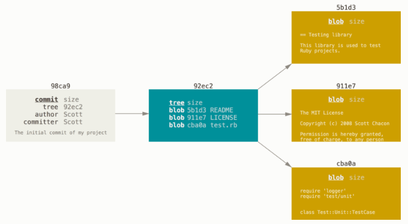
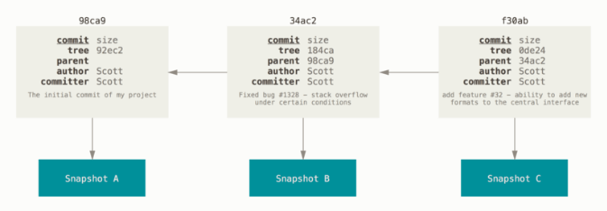
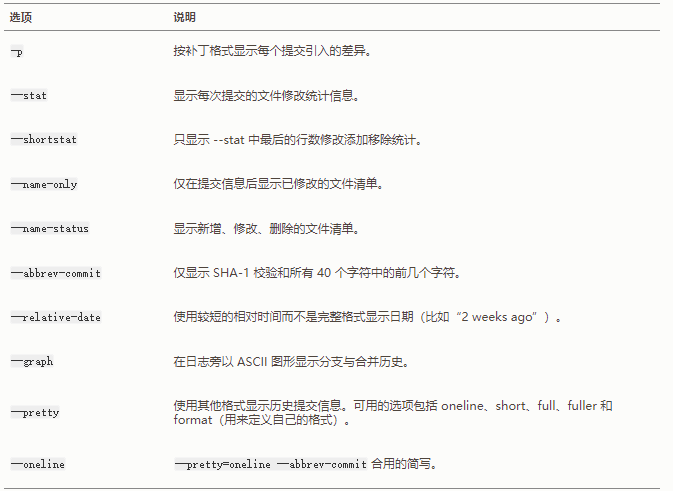
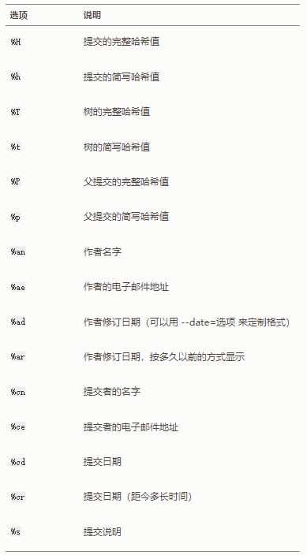
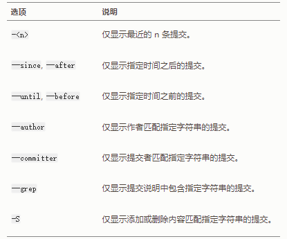
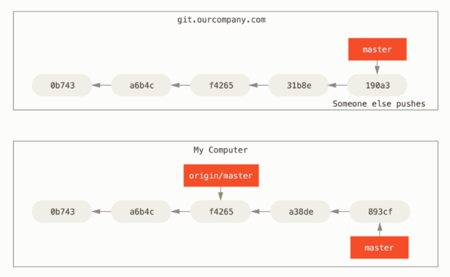
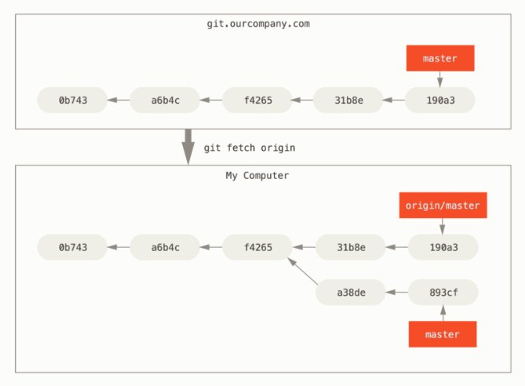
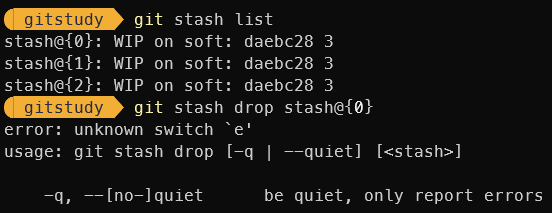
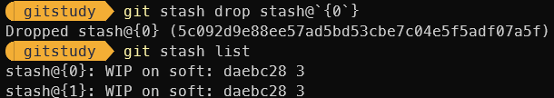

import Highlight from "@site/src/components/HighLight"


这里记录了Git Pro前五章所提到的命令，在记录命令的同时，我会将一些与命令相关的知识点也做一个简单记录，方便查看的时候能够更加清楚地认识到该命令的作用。

{/* truncate */}
## Git 基本配置
Git 自带一个 git config 的工具来帮助设置控制 Git 外观和行为的配置变量。这些变量存储在三个不同的位置
- <u>/etc/gitconfig</u> 文件，包含系统上每一个用户及他们仓库的通用配置。如果在执行 git config 时带上 `--system` 选项，那么它就会读写该文件中的配置变量（由于它是系统配置文件，因此你需要管理员或超级用户权限来修改它。）
- <u>~/.gitconfig 或 ~/.config/git/config</u> 文件，只针对当前用户。你可以传递 `--global` 选项让 Git 读写此文件，这会对你系统上**所有**的仓库生效。
- <u>.git/config</u>，当前使用仓库的 Git 目录中的 config 文件，针对该仓库。你可以传递 `--local` 选项让 Git 强制读写此文件，虽然默认情况下用的就是它。（当然，你需要进入某个 Git 仓库中才能让该选项生效。）

每一个级别会覆盖上一级别的配置，所以 .git/config 的配置变量会覆盖 /etc/gitconfig 中的配置变量。

### 查看配置信息
- `git config --list`  
将配置信息以列表的格式表现出来

- `git config --show-origin`  
将配置信息所在的文件路径显示出来

### 一些常见配置
正如这一节开头提到的，我们可以利用 git config 工具来实现配置 Git。当配置 Git 的时候，我们要注意这一配置的作用域，根据作用域来选择合适的选项。下面是一些常见配置信息的例子。
```shell
# 配置用户信息
git config --global user.name "BearProfessor"
git config --global user.email bear_professor@outlook.com

# 配置默认打开的文本编辑器为 Vscode
git config --global core.editor "code --wait"
```
上面是VsCode的例子，若想修改 git 默认打开的编辑器，请查阅[官方文档](https://git-scm.com/book/zh/v2/%E9%99%84%E5%BD%95-C%3A-Git-%E5%91%BD%E4%BB%A4-%E8%AE%BE%E7%BD%AE%E4%B8%8E%E9%85%8D%E7%BD%AE#ch_core_editor)

### 获取帮助
若你使用 Git 时需要获取帮助，有三种等价的方法可以找到 Git 命令的综合手册（manpage）
- `git help <verb>`
- `git <verb> --help`
- `man git-<verb>`

如果不需要全面的手册，可以只用 -h 来获取更加简明的help
- `git <verb> -h`

## Git 记录更新到仓库
### 获取 Git 仓库
通常有两种获取 Git 项目仓库的方式，两种方式都会在你的本地机器上得到一个工作就绪的 Git 仓库。
- `git init`  
将尚未进行版本控制的本地目录转换为 Git 仓库。该命令将创建一个名为 <u>.git</u> 的子目录，这个子目录含有你初始化的 Git 仓库中所有的必须文件，这些文件是 Git 仓库的骨干。

- `git clone <url>`  
从其它服务器克隆一个已存在的 Git 仓库，这个仓库名默认与远程仓库同名

- `git clone <url> <reponame>`  
克隆一个 Git 仓库，并将这个本地仓库起名为 reponame

:::info[克隆远程仓库的背后]

1. 这会在当前目录下创建一个 Git 仓库
2. 并在这个目录下初始化一个 <u>.git</u> 文件夹，从远程仓库拉取下所有数据放入 <u>.git</u> 文件夹，然后从中读取最新版本的文件的拷贝。 
3. 默认添加一个远程仓库，名为 origin
4. 默认创建一个远程跟踪分支，名为 origin/master；还有一个本地分支，名为 master，跟踪着 origin/master

:::

### 检查当前文件状态
我们知道 Git 中的文件无外乎两种状态——已跟踪和未跟踪。已跟踪又分为：未修改，已修改，已暂存三种状态。为了查询当前文件的状态，我们需要用到文件状态查询命令。

- `git status`  
查询当前所有文件的状态

- `git status -s` 或 `git status --short`  
查询当前所有文件的状态，得到一种格式更为紧凑的输出。新添加的未跟踪文件前面有 ?? 标记，新添加到暂存区中的文件前面有 A 标记，修改过的文件前面有 M 标记。输出中有两栏，左栏指明了暂存区的状态，右栏指明了工作区的状态。

### 查看已暂存和未暂存的修改
如果 git status 命令的输出对于你来说过于简略，而你想知道具体修改了什么地方，可以用 git diff 命令。

- `git diff`  
此命令比较的是工作目录中当前文件和暂存区域快照之间的差异。也就是修改之后还没有暂存起来的变化内容。若是所有文件都已经暂存起来了，那么这条命令将不会又任何显示。

- `git diff --staged` 或 `git diff --cached`  
比对已暂存文件与最后一次提交的文件差异。

### 暂存文件
当我们在修改，添加，删除某些文件之后，我们想要将修改保存下来。这时候我们就需要提交文件，在提交文件之前，最好先将需要提交的文件进行暂存。这就产生了一个问题：[为什么需要暂存区](/blog/tools/Git-base.mdx#为什么需要暂存区)。

- `git add <files>`  
这是个多功能命令：可以用它开始跟踪新文件，或者把已跟踪的文件放到暂存区，还能用于合并时把有冲突的文件标记为已解决状态等。

:::info[暂存操作的背后]
暂存背后的操作为：为每一个文件计算校验和（使用 SHA-1 哈希算法），然后会把当前版本的文件快照保存到 Git 仓库中（Git 使用 blob 对象来保存它们），最终将校验和加入到暂存区域等待提交。
:::

### 将文件从暂存区中移除
我们有时候会想将文件删除，但这个文件可能已经暂存了。若仅是从物理目录里面删除这个文件，在暂存区的文件列表中依旧存在着指向这个文件快照的索引，因此，在提交的时候依旧会将这个文件的快照保存下来。为了将文件从暂存区中删除，我们需要移除文件命令。

- `git rm <file>`  
将文件从暂存区中移除，并且也会删除物理目录里面的文件。这个命令只能移除自从上次提交之后没有修改过的文件。

- `git rm -f <file>`  
若想将一个修改过的文件移除，我们需要使用 `-f` 选项，这是一种安全特性，用于防止误删尚未添加到快照的数据，这样的数据不能被 Git 恢复。

  若我们使用了 `rm <file>`，再用 `git rm <file>` 命令，一样可以将修改过的文件进行删除，在暂存区和物理目录里面都会删除。

- `git rm --cached <file>`  
把文件从 Git 仓库中删除（亦即从暂存区域移除），但仍然保留在当前工作目录中。换句话说，你想让文件保留在磁盘，但是并不想让 Git 继续跟踪。当你忘记添加 .gitignore 文件，不小心把一个很大的日志文件或一堆 .a 这样的编译生成文件添加到暂存区时，这一做法尤其有用。

:::info[使用通配符匹配要移除的文件]
git rm 命令后面可以列出文件或者目录的名字，也可以使用 glob 模式。比如
```bash
$ git rm log/\*.log
```
注意到星号 * 之前的反斜杠 \， 因为 Git 有它自己的文件模式扩展匹配方式，所以我们不用 shell 来帮忙展开。 此命令删除 log/ 目录下扩展名为 .log 的所有文件。
:::

### 移动文件
- `git mv <file_from> <file_to>`  
移动文件，这不仅会修改暂存区中文件列表的信息，也会移动实际物理目录中的文件。若没有指定路径，只给了文件名，实现的作用就是给文件改名。实际上，这条命令是三条命令的合并。
```shell
mv <file_from> <file_to>
git rm <file_from>
git add <file_to>
```

### 提交文件
当你确定将文件修改完成的时候，或者你担心文件丢失，此时都可以将文件进行提交。只要你将文件进行了提交，就可以将这个文件快照保存下来。

- `git commit`    
将当前暂存的内容提交至版本库保存下来。当执行这条命令的时候，会打开设定好的文本编辑器，然后让你输入这一次提交的描述信息。退出编辑器时，Git 会丢弃注释行，用你输入的提交说明生成一次提交。

- `git commit -m <description>`  
也可以将提交信息与命令放在同一行，这样无需打开编辑器编辑提交说明。

- `git commit -a`  
跳过使用暂存区，Git 会自动把所有**已经跟踪过的文件**暂存起来一并提交，从而跳过 git add 步骤。但这个需要小心，跳过暂存区直接提交可能会不小心提交某些不想提交的文件。

<details>
  <summary>提交操作的背后</summary>
  <div>
    第一次提交：Git 会先计算每一个子目录的校验和， 然后在 Git 仓库中这些校验和保存为树对象。随后，Git 便会创建一个提交对象，它除了包含上面提到的那些信息外，还包含指向这个树对象（项目根目录）的指针。 如此一来，Git 就可以在需要的时候重现此次保存的快照。

    

    后续提交：提交对象除了包含上述内容，还会包含一个指向父对象的指针

    
  </div>
</details>

### 忽略文件
一般我们总会有些文件无需纳入 Git 的管理，也不希望它们总出现在未跟踪文件列表。 通常都是些自动生成的文件，比如日志文件，或者编译过程中创建的临时文件等。 在这种情况下，我们可以创建一个名为 `.gitignore` 的文件。关于 gitignore 文件的格式详情可以查阅[官方文档](https://git-scm.com/book/zh/v2/Git-%E5%9F%BA%E7%A1%80-%E8%AE%B0%E5%BD%95%E6%AF%8F%E6%AC%A1%E6%9B%B4%E6%96%B0%E5%88%B0%E4%BB%93%E5%BA%93)。

## 查看提交历史
在提交了若干更新，又或者克隆了某个项目之后，我们可以利用命令来查看提交历史。
- `git log`  
按时间先后顺序列出所有的提交，最近的更新排在最上面。这个命令会列出每个提交的 SHA-1 校验和、作者的名字和电子邮件地址、提交时间以及提交说明。

- `git log -p` 或 `git log --patch`  
除了显示上一条命令的提交信息之外，还显示每一次提交的修改，补丁（patch）。

- `git log --stat`  
除了显示基本信息外，还可以看到每次提交的简略统计信息。会列出修改的文件，以及每个文件修改了多少，所有文件总共修改了多少的数值。这是一个统计（statistic）信息，不会显示出每一个文件修改的内容。

- `git log --decorate`   
这是查看提交记录，但是在显示的时候，也会显示分支指向哪个提交记录。

### 查看提交历史常用选项

### 提交历史的显示格式
- `git log --graph`  
这个选项添加了一些 ASCII 字符串来形象地展示你的分支、合并历史

- `git log --pretty`  
这个选项可以使用不同于默认格式的方式展示提交历史。这个选项有一些内建的子选项供你使用。 比如 oneline 会将每个提交放在一行显示，在浏览大量的提交时非常有用。 另外还有 short，full 和 fuller 选项，它们展示信息的格式基本一致，但是详尽程度不一。

- `git log --pretty=format:""`  
我们可以在 format 后利用不同的格式占位符来定制提交记录的显示格式。

```shell
git log --pretty=oneline

## 显示结果
$ 0417011cb8bc83bd8556de50bedf5508869c23b9 (HEAD -> master) second commit
$ ede8d616d0c30e6251287fe22b812d17496637c2 first commit

git log --pretty=format:"%h - %s"

## 显示结果
$ 0417011 - second commit
$ ede8d61 - first commit
```

从上面可以看到，我们在 format 后跟一个字符串，这个字符串就表示了显示的样式。在这个字符串中有一些 %h，%s，这是占位符，告诉 Git 在展示的时候该用什么来替换掉这个占位符。下面列了一些常用的占位符。




### 限制输出长度
这个实际上就利用各种选项来挑选出我们需要的提交记录，而这些记录往往只是所有记录中的一部分，因此也就限制了输出的长度。

- `git log --no-merges`  
按照你代码仓库的工作流程，记录中可能有为数不少的合并提交，它们所包含的信息通常并不多。为了避免显示的合并提交弄乱历史记录，可以为 log 加上 --no-merges 选项。

- `git log -<n>`  
显示最近 n 条提交记录。

还有一些其他常用的选项。



## 撤销操作
在工作中，难免会遇见误操作，或者是想法的改变，这都可能让你想要撤销之前的某个操作。

- `git commit --amend`  
如果你想修改之前提交的信息，可以利用这个命令，这个命令会将当前暂存区的内容进行提交，并生成一个全新的提交对象替换掉之前的提交对象。

- `git reset HEAD <file>`  
这个命令用来将某个文件取消暂存。

- `git checkout -- <file>`  
对指定文件在本地的任何修改都会消失——Git 会用最近提交的版本覆盖掉它。

## 版本回退和重置
### 版本回退
当我们在提交了几次记录之后，想回到先前的某一个版本，可以采用版本回退命令。若想查看对于这些命令更加详细的解释，可以查看[官方文档](https://git-scm.com/book/zh/v2/Git-%E5%B7%A5%E5%85%B7-%E9%87%8D%E7%BD%AE%E6%8F%AD%E5%AF%86)。

- `git reset --soft <SHA1>`  
这会保留当前的工作区和暂存区内容，仅修改了 HEAD 分支指向。

- `git reset --mixed <SHA1>`  
这会保留当前的工作区内容，而暂存区内容看起来像 HEAD。

- `git reset --hard <SHA1>`  
工作区和暂存区内容全部不保留，回到当时提交该 SHA1 指向的提交刚提交时的情况。

:::info[版本回退的背后]
这些 reset 命令的共同点在：将当前的分支指向指定的提交记录，而 HEAD 也指向这个移动过后的分支，这就使得——原来指向的提交记录没有分支指向它，我们无法通过分支来找到它。这就与下面提到的重置有关了。
:::

### 回退操作的重置
若我们想要回退到先前的版本，就需要我们找到先前那个提交记录，而这个提交记录我们无法通过分支来寻找。

```shell
# 可以将所有的提交记录显示出来，这样我们就可以找到任意一个提交记录的 SHA1 校验和。
git reflog

# 我们可以创建新的分支指向这个提交记录，这样就可以切换到这个提交记录。
git branch <branch> <SHA1>

# 切换到新的分支上来。
git checkout <branch>
```

## 远程仓库的使用
### 查看远程仓库
- `git remote`  
列出你指定的每一个远程服务器的简写（远程仓库本来是 url，我们在添加远程仓库的时候会指定一个简写来指代这个 url）。如果克隆了一个仓库，我们至少能看到 origin。

- `git remote show <remote>`  
查看指定远程仓库的详细信息。

- `git remote -v`
会显示需要读写远程仓库使用的 Git 保存的简写与其对应的 URL。它同样会列出远程仓库的 URL 与跟踪分支的信息。

### 新建远程仓库
- `git remote add <shortname> <url>`  
添加一个远程 Git 仓库，同时指定一个方便使用的简写。

### 远程仓库的重命名与移除
- `git remote rename <oldname> <newname>`  
修改远程仓库的名字，同样也会修改你所有远程跟踪的分支名字。 那些过去引用 oldname/master 的现在会引用 newname/master。

- `git remote remove <remote>`  
删除远程仓库，一旦你使用这种方式删除了一个远程仓库，那么所有和这个远程仓库相关的远程跟踪分支以及配置信息也会一起被删除。

### 从远程仓库中抓取和拉取
- `git fetch <remote>`  
从远程仓库中抓取所有本地仓库没有的数据（包括提交对象，文件快照对象，树对象等），执行完成之后，会拥有那个仓库 **所有** 分支的引用，可以合并到当前分支进行查看。

- `git pull`  
如果你的当前分支设置了跟踪远程分支，那么可以用 git pull 命令来自动抓取后合并该远程分支到当前分支。 

<details>
    <summary>为什么 git fetch 命令执行了之后工作目录没有任何变化</summary>
        <div>
          抓取实际上会完成以下操作：
          1. 将所有本地没有的数据抓取到本地仓库（包括提交对象）
          2. 在本地会创建跟踪分支来跟踪对应的远程分支。这个跟踪分支我们并不能去移动它，只有在从远程仓库抓取数据有更新时自己移动至对应提交对象上。

          抓取前：
          

          抓取后：
          

          从上面的图可以看到，git fetch 命令的确将数据抓取到本地仓库了，但是只是创建了一个跟踪分支来指向远程仓库的提交记录，并没有将这个分支合并到当前分支上，那自然也不会在当前分支看到远程仓库的记录。
        </div>
</details>

### 推送到远程仓库
- `git push <remote> <branch>`  
只有当你有所克隆服务器的写入权限，并且之前没有人推送过时，这条命令才能生效。当你和其他人在同一时间克隆，他们先推送到上游然后你再推送到上游，你的推送就会毫无疑问地被拒绝。你必须先抓取他们的工作并将其合并进你的工作后才能推送。 

## 打标签
其他版本控制系统（VCS）一样，Git 可以给仓库历史中的某一个提交打上标签，以示重要。比较有代表性的是人们会使用这个功能来标记发布结点（v1.0 、v2.0 等等）。

### 列出标签
- `git tag`  
列出已有的标签清单，这个命令以字母顺序列出标签。

- `git tag -l` 或 `git tag --list`  
列出已有的标签清单。

- `git tag -l "glob模式字符串"` 或者 `git tag --list "glob模式字符串"`  
列出匹配指定模式的标签清单。

### 查看标签信息
- `git show <tagname>`  
看到标签信息和与之对应的提交信息。

### 创建标签
Git 支持两种标签：轻量标签（lightweight）与附注标签（annotated）。

**轻量标签**很像一个不会改变的分支——它只是某个特定提交的引用。

而**附注标签**是存储在 Git 数据库中的一个完整对象， 它们是可以被校验的，其中包含打标签者的名字、电子邮件地址、日期时间， 此外还有一个标签信息，并且可以使用 GNU Privacy Guard （GPG）签名并验证。 通常会建议创建附注标签，这样你可以拥有以上所有信息。但是如果你只是想用一个临时的标签， 或者因为某些原因不想要保存这些信息，那么也可以用轻量标签。

- `git tag -a <tagname>`
给最近的提交对象添加附注标签。-a 选项说明我们生成的标签是附注标签。

- `git tag -m "description"`  
-m 选项指定了一条将会存储在标签中的信息。如果没有为附注标签指定一条信息，Git 会启动编辑器要求你输入信息。

- `git tag <tagname>`  
给提交打轻量标签，轻量标签本质上是将提交校验和存储到一个文件中，是提交对象的引用。

- `git tag [-a] <tagname> <SHA1>`  
后期给提交打标签，可以选择轻量标签或者附注标签。SHA1 就是我们指定的提交。

### 共享标签
- `git push <remote> <tagname>`  
默认情况下，git push 命令并不会传送标签到远程仓库服务器上。在创建完标签后你必须显式地推送标签到共享服务器上。

- `git push <remote> --tags`  
如果想要一次性推送很多标签，也可以使用带有 --tags 选项的 git push 命令。 这将会把所有不在远程仓库服务器上的标签全部传送到那里。这个命令不会区分轻量标签和附注标签。

### 删除标签
- `git tag -d <tagname>`  
删除掉你本地仓库上的标签。

- `git push <remote> --delete <tagname>`  
删除远程仓库上的标签。

## Git 分支
### 分支查看
我们常常会想查看有什么分支，以及分支指向什么提交对象，这需要用到分支查看指令。
- `git branch`  
查看有哪些本地分支

- `git branch -v`  
列出所有本地分支的分支名称，指向的提交对象的校验和，提交记录的描述信息等内容

- `git branch -vv`  
比上一条命令包含更多的信息，如每一个分支正在跟踪哪个远程分支与本地分支是否是领先、落后或是都有。**需要重点注意的一点是这些信息来自于你从每个服务器上最后一次抓取的数据。这个命令并没有连接服务器，它只会告诉你关于本地缓存的服务器数据。**

- `git log --decorate`   
这是查看提交记录，但是在显示的时候，也会显示分支指向哪个提交记录。

- `git branch --merged [<branch>]`  
查看已经合并到指定分支的分支有哪些，若没有指定分支，则默认为当前分支

- `git branch --no-merged [<branch>]`  
查看尚未合并到指定分支的分支有哪些，若没有指定分支，则默认为当前分支

### 分支创建
- `git branch <branch>`  
在当前所在的提交对象创建一个指针。这个命令只会创建一个分支，并不会切换到这个分支上去。

- `git branch <branch> <SHA1>`  
给指定的提交对象创建一个分支指向它，但并不会切换到这个分支上。

- `git checkout -b <branch>`  
在当前所在的提交创建一个分支，并且立刻切换到这个分支上。

### 分支切换
- `git checkout <branch>`  
切换到一个已存在的分支。这个命令实际上完成了两件事情：一是使 HEAD 指向指定分支，二是将工作目录恢复成该分支所指向的快照内容。

- `git checkout -b <branch>`  
在当前所在的提交创建一个分支，并且立刻切换到这个分支上。

:::info[分支切换会改变你工作目录中的文件]
在切换分支时，一定要注意你工作目录里的文件会被改变。 如果是切换到一个较旧的分支，你的工作目录会恢复到该分支最后一次提交时的样子。 如果 Git 不能干净利落地完成这个任务，它将禁止切换分支。实际情况中，可能需要你临时切换到某一个分支上进行工作，但是你当前工作目录内容还没有修改完，而且你并不希望就这些修改内容形成一次提交信息。这里就需要用到[贮藏工具]
:::

### 删除分支
当我们不小心创建了一个自己不需要的分支之后，或者说这个分支的任务已经完成，我们会想删除这个分支。我们可以既可以删除本地分支，也可以删除远程分支。

- `git branch -d <branch>`  
删除本地分支

- `git push <remote> --delete <branch>`  
从服务器上删除分支，基本上这个命令做的只是从服务器上移除这个指针。Git 服务器通常会保留数据一段时间直到垃圾回收运行，所以如果不小心删除掉了，通常是很容易恢复的。

### 分支合并
在将主题分支修改完成后，我们会想将这个分支合并到主分支；或者在提交更新时，我们首先要将别人的更新拉取下来合并到自己的更新之后才能提交。

- `git merge <branch>`  
将指定的分支合并到当前分支，注意：当前是在主分支，而指定的分支是主题分支。

分支的合并会出现 **快进**（fast-forward），**三方合并**（当前分支、被合并的分支、两者的共同祖先分支三者合并，最终会得到一个新的提交，并让当前分支指向这个新建的提交）等情况。

在合并两者对同一个地方都有进行修改的时候，还会引发 **冲突** ，当引发了冲突之后，我们可以利用 `git status` 来查看处于未合并状态的文件有哪些，然后就可以到这些文件中进行手动修改。在修改完毕之后，我们需要手动将这一次合并进行 commit。

### 跟踪远程分支
我们在进行`git fetch <remote>`之后会将原有的远程跟踪分支移动到更新之后的位置，同时还会创建之前没有的远程跟踪分支，**但并不会创建一个工作副本，也不会新建一个跟踪分支来跟踪这个远程分支**，我们可能会想要跟踪这个新建的远程跟踪分支。不仅如此，我们在写代码的时候，也可能会想修改某个分支跟踪的上流分支。这就需要使用到分支跟踪的相关命令。

- `git branch -u <remote>/<branch>` 或 `git branch --set-upstream-to <remote>/branch`   
设置已有的本地分支跟踪一个刚刚拉取下来的远程分支，或者想要修改正在跟踪的上游分支

- `git checkout -b <branch> <remote>/<branch>`   
创建一个跟踪分支，跟踪指定的远程分支，然后切换到该分支上进行工作

- `git checkout --track <remote>/<branch>`   
上个命令的快捷方式，创建的跟踪分支名称默认与远程跟踪分支名称一致

- `git checkout <branch>`  
如果你尝试检出的分支（1）不存在且（2）刚好只有一个名字与之匹配的远程分支，那么 Git 就会为你创建一个跟踪分支。

## Git 工具
### 贮藏与清理
当我们在当前分支已经完成了一些工作，此时又想切换回另一个版本进行工作。直接进行 `checkout` 分支切换会要求工作区干净，而你又不想将这一点修改单独进行一次提交，就需要进行贮藏。针对这个问题的答案是 git stash 命令。

贮藏（stash）会处理工作目录的脏的状态——即跟踪文件的修改与暂存的改动——然后**将未完成的修改保存到一个栈上， 而你可以在任何时候重新应用这些改动（甚至在不同的分支上）**。若想了解更多内容，可以查询[官方文档](https://git-scm.com/book/zh/v2/Git-%E5%B7%A5%E5%85%B7-%E8%B4%AE%E8%97%8F%E4%B8%8E%E6%B8%85%E7%90%86#_git_stashing)

- `git stash`  
贮藏修改，将新的贮藏推送到栈上，这个贮藏的内容包括暂存区和工作区的内容。此时，当我们切换到别的分支进行工作的时候，这个修改依旧贮藏在栈上，我们可以将其应用到当前目录上。

- `git stash list`  
查看贮藏的修改。

- `git stash apply`  
将最近的贮藏的工作重新应用，不会将之前暂存的修改重新暂存起来。

- `git stash apply <stashname>`
应用指定的贮藏，不会将之前暂存的修改重新暂存起来。

- `git stash apply --index`  
应用最近的贮藏工作，还会将贮藏时的暂存文件重新暂存。

- `git stash drop <stashname>`  
应用贮藏的时候，并不会将贮藏记录从栈中移除。在我们应用了相应的贮藏之后，若想将该贮藏从栈中移除，就需要用到这个命令。

- `git stash pop`  
应用贮藏然后立即从栈上扔掉它。

:::warning[可能的出错情况]
在Powershell中使用 git stash drop stash@{0}时会报错，报错显示为 



这种问题是因为花括号在 PowerShell 中被认为是代码块执行标识符，若想正常使用，可用反引号 `进行转义 


:::

