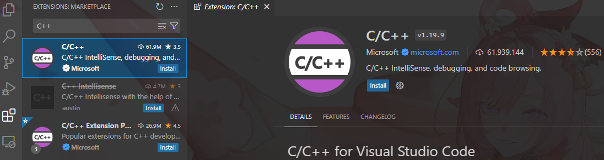
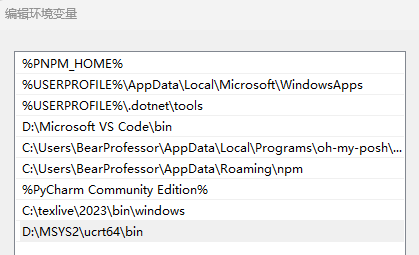
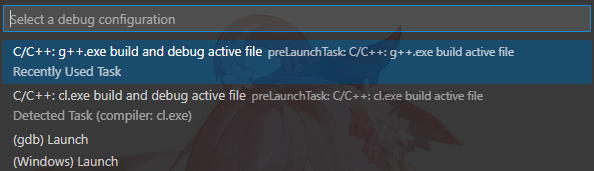
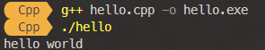

export const Highlight = ({children, color}) => ( <span style={{
    backgroundColor: color,
    borderRadius: '0.4rem',
    color: '#fff',
    padding: '0.2rem',
    }}>{children}</span> );

在用了一段时间的visual studio之后，觉得visual studio打开以及创建项目都较慢，而我日常写的C++代码比较小，因此转而使用轻量的编辑器Vscode。

{/* truncate */}

## 前提
vscode只是一个文本编辑器，需要编译器才能编译C++文件，我们需要以下工具
1. C++ 扩展插件。
2. g++(GCC C++ compiler)
3. gdb Debugger 

### 下载C++扩展插件


### 下载MinGW-w64工具链
MinGW-w64工具链中包含了g++和gdb Debugger。我们利用MSYS2来下载这个工具链。

<Highlight color="#fbb656">Step 1</Highlight>
根据官方提供的 [下载链接](https://github.com/msys2/msys2-installer/releases/download/2024-01-13/msys2-x86_64-20240113.exe) 来下载MSYS2，然后跟着下载程序走即可。

<Highlight color="#fbb656">Step 2</Highlight>
运行MSYS2程序，在打开的MSYS2终端中输入以下命令，然后都按照默认配置下载即可。
```bash
pacman -S --needed base-devel mingw-w64-ucrt-x86_64-toolchain
```

<Highlight color="#fbb656">Step 3</Highlight>
将MinGW-w64的bin文件夹路径添加到**PATH**环境变量中



<Highlight color="#fbb656">Step 4</Highlight>
检验MinGW-w64是否正确下载，若正确下载，运行下面的命令时会出现相应的版本信息。
```bash
gcc --version
g++ --version
gdb --version
```

## 创建新文件并运行
我们需要在vscode中新建一个`.cpp`文件。然后点击右上角的运行按钮，选择 **Run C/C++ File**。若是第一次运行这个文件，选择 **g++**。若是要调试这个文件，在文件中加上断点，然后选中 **Debug C/C++ File**。若是第一次调试这个文件，选择 **g++**。



当然我们也可以用终端来运行文件。打开终端之后，进入到编译文件所在目录，以hello.cpp为例子



## 配置编译和调试功能
### task.json
vscode在第一次编译C++文件的时候，C++插件会自动创建`task.json`，这个`json`文件中包含的内容是：编译器编译时的配置，详细的内容可以查看[官方教程](https://code.visualstudio.com/docs/cpp/config-mingw#_understanding-tasksjson)

```javascript title="tasks.json"
{
    "tasks": [
        {
            "type": "cppbuild",
            // 刚才选择选择的编译器列表中的描述
            "label": "C/C++: g++.exe build and debug active file",
            // 编译器的路径
            "command": "D:\\MSYS2\\mingw64\\bin\\g++.exe",
            // 传递给 g++ 命令的参数
            "args": [
                "-fdiagnostics-color=always",
                "-g",
                "${file}",
                "-o",
                "${fileDirname}\\${fileBasenameNoExtension}.exe"
            ],
            "options": {
                "cwd": "${fileDirname}"
            },
            "problemMatcher": [
                "$gcc"
            ],
            "group": {
                "kind": "build",
                "isDefault": true
            },
            // 任务列表中该任务的描述，官方强烈建议修改这个值以区分任务列表中的相似任务
            "detail": "Task generated by Debugger."
        }
    ],
    "version": "2.0.0"
}
```

上面传给 g++ 命令的参数仅包括一个文件，若我们想要一次性编译多个文件并链接，可以修改参数：
```javascript
"args": [
        "-fdiagnostics-color=always",
        "-g",
        "${workspaceFolder}/*.cpp",
        "-o",
        "${workspaceFolder}\\myProgram.exe"
    ],
```
这样，当我们编译文件的时候，就会将工作目录中的所有以`.cpp`为后缀的文件一起编译链接，最后在工作目录下生成一个`myProgram.exe`文件。这里的 workspaceFolder 是一个变量，可以查看[变量参考](https://code.visualstudio.com/docs/editor/variables-reference)。

### launch.json
vscode可以设置断点，查看监视来进行debug。同时还可以自定义debug的配置，在debug时会自动创建`launch.json`文件，这里面包含了debug的配置。详细的内容可以查阅：
- [在Vscode中调试C++程序](https://code.visualstudio.com/docs/cpp/cpp-debug)
- [配置调试功能](https://code.visualstudio.com/docs/cpp/launch-json-reference)
```javascript title="launch.json"
{
    "version": "0.2.0",
    "configurations": [
        {
            "name": "C/C++: g++.exe build and debug active file",
            "type": "cppdbg",
            "request": "launch",
            "program": "${fileDirname}\\${fileBasenameNoExtension}.exe",
            "args": [],
            "stopAtEntry": false,
            "cwd": "${fileDirname}",
            "environment": [],
            "externalConsole": false,
            "MIMode": "gdb",
            "miDebuggerPath": "D:\\MSYS2\\ucrt64\\bin\\gdb.exe",
            "setupCommands": [
                {
                    "description": "Enable pretty-printing for gdb",
                    "text": "-enable-pretty-printing",
                    "ignoreFailures": true
                },
                {
                    "description": "Set Disassembly Flavor to Intel",
                    "text": "-gdb-set disassembly-flavor intel",
                    "ignoreFailures": true
                }
            ],
            "preLaunchTask": "C/C++: g++.exe build active file"
        }
    ]
}
```

### c_cpp_properties.json
可以通过修改`c_cpp_properties.json`这个文件来修改C++插件配置，也可以通过UI界面来修改，可以查看[官方文档](https://code.visualstudio.com/docs/cpp/config-mingw#_adding-additional-cc-settings)

1. 通过命令行查找`C/C++: Edit configurations(UI)`
2. 按下enter，进入UI配置界面
3. 在界面中修改内容，Vscode会把这些修改自动添加到`c_cpp_properties`中去

## 参考
- [**VScode官方文档**](https://code.visualstudio.com/docs/cpp/config-mingw)
- [**tasks.json的变量参考**](https://code.visualstudio.com/docs/editor/variables-reference)
- [**在Vscode中调试C++程序**](https://code.visualstudio.com/docs/cpp/cpp-debug)
- [**配置调试功能**](https://code.visualstudio.com/docs/cpp/launch-json-reference)