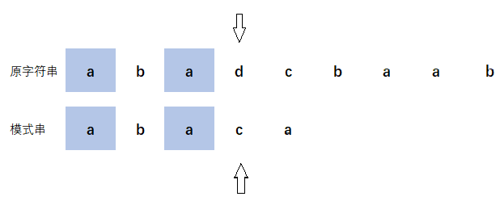

## 用途
在一个字符串中寻找与模式串相同的子串

## 思路
***暴力解法***
1. 指针 $i$ 指向字符串的第 0 个位置，指针 $j$ 指向模式串的第 0 个位置。
2. 若两个指针指向字符相同，则两者同时向右移动一位，直到移动至模式串末尾。
3. 若两个指针指向字符不同，指针 $i$ 要回退至第 $a(a = 1, 2, 3......n)$ 个位置，指针 $j$ 要回退至第 0 个位置。
4. 时间复杂度是 $O(nm)$，$n$ 是字符串的长度，$m$ 是模式串的长度

***优化（举例）：***假设我们在模式串位置为 $j(j > 0)$ 时发生不匹配

上面这个例子当中，由于前缀 a 与后缀 a 中