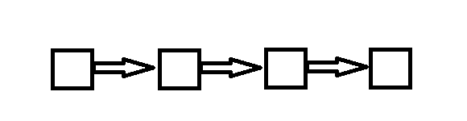

import Tabs from '@theme/Tabs';
import TabItem from '@theme/TabItem';

## 单链表

### 定义
链表逻辑上是一个线性表，数据之间呈一对一的关系。在物理存储上，链表中的每个元素都是分散存储的，要实现线性的逻辑结构，每一个链表结点不仅需要存储值，还需要存储相邻点的地址，这样就会形成类似链子的结构。

而所谓的单链表，就是只有单方向的指针，每一个链表结点都存储有下一个结点的地址。



### 优缺点
- 优点
    1. 方便插入与删除，时间复杂度是$O(1)$
- 缺点
    1. 不能随机访问，要访问某个位置的结点只能从前往后依次遍历

### 代码实现
<Tabs>
<TabItem value="array" label="数组形式">

```cpp
class List {
public:
    // 初始化构造函数
    List() {
        // 设置头结点，0号位置代表的就是头结点
        idx = 1;
        ne[0] = -1;
    }
    // 判断是否为空
    bool isEmpty() {
        return ne[0] == -1;
    }
    // 判断是否已满
    bool isFull() {
        return idx == N;
    } 
    // 向链表头部插入一个数 x
    bool insertFromHead(int x) {
        if(isFull()) return false;
        val[idx] = x;
        ne[idx] = ne[0];
        ne[0] = idx++;
        return true;
    }
    // 删除第k个插入的数后面的数
    bool deleteKth(int k) {
        ne[k] = ne[ne[k]];
        return true;
    }
    // 在第k个插入的数后面插入一个数
    bool insertAfterKth(int k, int x) {
        val[idx] = x;
        ne[idx] = ne[k];
        ne[k] = idx++;
        return true;
    }
    void printList() {
        // 从头节点开始读
        int current = ne[0];
        while(current != -1) {
            cout << val[current] << " ";
            current = ne[current];
        }
    }
private:
    int val[N], ne[N];
    int idx;
};
```

</TabItem>
<TabItem value="list" label="链表形式">

```cpp
#include<iostream>
using namespace std;

class listNode
{
public:
	listNode()
	{
		next = NULL;
	}
	listNode(int v)
	{
		val = v;
		next = NULL;
	}
public:
	int val;
	listNode* next;
};

class List
{
public:
	// 构造函数
	List()
	{
		head.next = NULL;
	}
	// 判断是否已空
	bool isEmpty()
	{
		return head.next == NULL;
	}
	// 加入结点
	bool insert_head(int val)
	{
		listNode* node = new listNode(val);
		node->next = head.next;
		head.next = node;
		return true;
	}
	// 删除结点
	bool del_head()
	{
		if (head.next == NULL) return false;
		listNode* p = head.next;
		head.next = p->next;
		delete p;
	}
	// 打印链表
	void print()
	{
		for (listNode* p = head.next; p != NULL; p = p->next)
		{
			cout << p->val << " ";
		}
		cout << endl;
	}
private:
	listNode head;
};

```

</TabItem>
</Tabs>


## 双链表

### 定义
除了头尾结点，每一个链表结点都有一个前驱和一个后继

### 代码实现
```cpp
#include<iostream>
#include<string>
using namespace std;

const int N = 100010;

class doubleDirectionList {
public:
    // 构造函数
    doubleDirectionList() {
        // 0号是头结点，1号是尾结点
        r[0] = 1;
        l[1] = 0;
        idx = 2;
    }
    // 在位置 loc 右侧插入一个数x
    void insertAfterLoc(int loc, int x) {
        val[idx] = x;
        // 记录位置k右侧节点
        int loc_r = r[loc];
        l[idx] = loc;
        r[idx] = loc_r;
        r[loc] = idx;
        l[loc_r] = idx++;
    }
    // 在最左侧插入一个数
    void insertLeft(int x) {
        insertAfterLoc(0, x);
    }
    // 在最右侧插入一个数
    void insertRight(int x) {
        insertAfterLoc(l[1], x);
    }
    // 在第k个插入的数右侧插入一个数
    void insertAfterK(int k, int x) {
        insertAfterLoc(k + 1, x);
    }
    // 在第k个插入的数左侧插入一个数
    void insertBeforeK(int k, int x) {
        insertAfterLoc(l[k + 1], x);   
    }
    // 将第k次插入的数删除
    void deleteKth(int k) {
        r[l[k + 1]] = r[k + 1];
        l[r[k + 1]] = l[k + 1];
    }
    // 从左到右输出链表
    void print() {
        int i = r[0];
        while(i != 1) {
            cout << val[i] << " ";
            i = r[i];
        }
    }
private:
    int val[N], l[N], r[N];
    int idx;
};

```