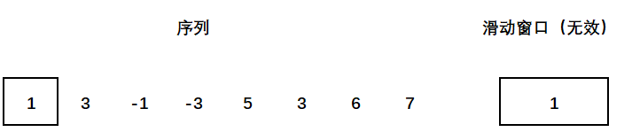
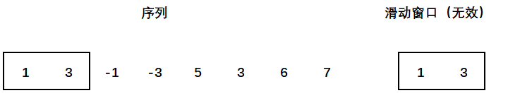
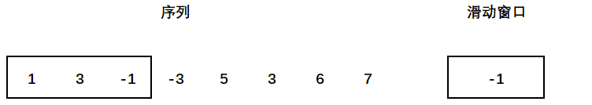
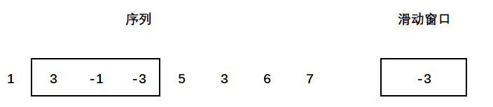
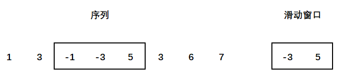
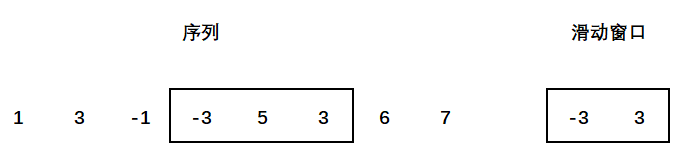
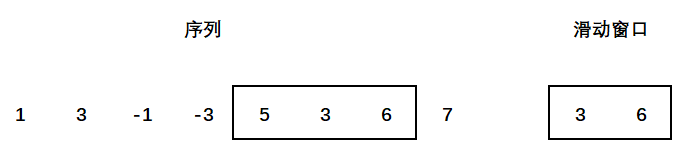
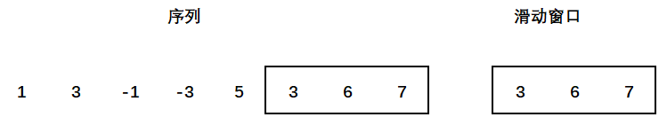

## 定义
队列中的元素从具有单调性

## 用途
用于求解滑动窗口的最值问题

## 思路
假定给定了一个无序的序列 $array[8] = [1,3,-1,-3,5,3,6,7]$，有一个大小为 $k$ 的窗口，窗口从序列的最左边移动到最右边，求**每一次窗口中的最大值和最小值。**

***暴力解法：***我们用一个队列来代表窗口，窗口每一次的滑动意味着一次出队和一次入队。每一次求解这个窗口中的最大值和最小值，都需要遍历整个队列，时间复杂度为 $O(k)$，总体的时间复杂度为 $O(nk)$，其中 $n$ 是移动的次数，$k$ 代表着遍历一次窗口。

***优化思路：***我们可以发现，每一次想要得到窗口中最值的时候都需要遍历整个窗口，但其中存在着一些一定不会是最值的数值。  **例如：**假设我们要查找窗口中的最小值，此时窗口为 $[-3,5,3]$，我们可以发现，由于 3 的存在，前面的 5 一定不会是最小值，因为当窗口向右移动时，若 5 存在，3 也一定存在，这就说明 5 是一个冗余，我们可以去掉这个冗余。

***单调队列解法：***根据上面的优化思路，我们可以发现，当我们在查找窗口中 **最小值** 的时候，每一次移动加入一个数的时候，窗口中比它大的数一定是无效的，因此我们可以对这些数出队，最后窗口中的元素应该呈现单调递增的状态。

假设我们求最小值，窗口大小为3，以下是图例：


















## 代码实现

```cpp
#include<iostream>
#include<vector>
using namespace std;

const int N = 1000010;
// q 是窗口，每一个位置上存着 a[i] 中的 i，也就是某一元素对应的下标。
// a 存放着序列
int q[N], a[N];
// 用 minInSection 来存储窗口滑动到这个位置的最小值，maxInSection同理。
vector<int> minInSection, maxInSection;

void func() {
    
    // 找最小值
    // head 代表队列的头部，tail代表队列的尾部
    int head = 0, tail = -1;
    for(int i = 0; i < n; i++) 
    {
        // 避免窗口大小超过k
        if(q[head] < i - k + 1) head++;
        while(head <= tail && a[q[tail]] > a[i]) tail--;
        q[++tail] = i;
        if(i >= k - 1) minInSection.push_back(a[q[head]]);
    }
    
    // 找最大值
    head = 0, tail = -1;
    for(int i = 0; i < n; i++) 
    {
        if(q[head] < i - k + 1) head++;
        while(head <= tail && a[q[tail]] < a[i]) tail--;
        q[++tail] = i;
        if(i >= k - 1) maxInSection.push_back(a[q[head]]);
    }
}
```


## 相关题目
[**Acwing：滑动窗口**](https://www.acwing.com/problem/content/156/)