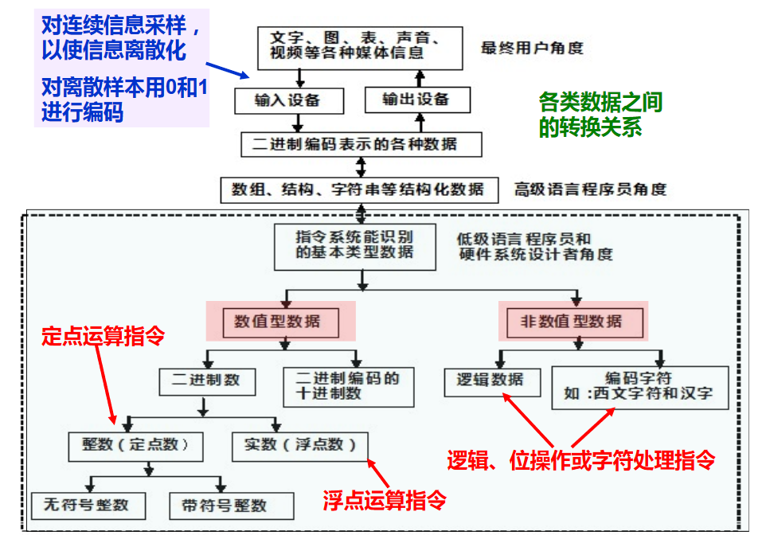

从外部形式来看，计算机可以处理数值，文字，图，声音，视频等各种模拟信息，但是从机器的视角来看，其实它只能处理整数、浮点数和位串这几种简单的数据类型。这就要求我们要能够将外部信息进行**“数字化编码”**。

为了实现数字化编码，输入设备必须能够进行**“离散化”**和**“编码”**，因为计算机中存储位数是有限的，因此只能存储离散化的数据。

从上图中可以看到，计算机中的数据主要分为**数值数据**和**非数值型数据**，后面的内容将从这两方面展开。

对于一个数值型数据，我们需要了解以下三点才能确定这个数值数据的值
1. 数制
2. 定/浮点表示
3. 编码表示