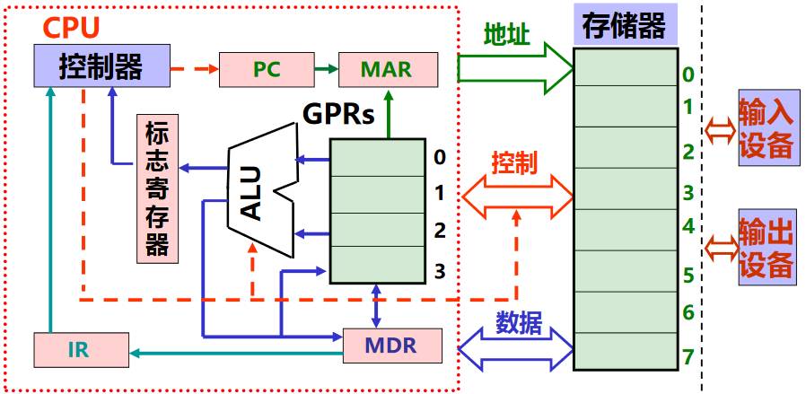

## 冯·诺依曼思想与结构
### 思想

1945年，冯·诺依曼提出了**“存储程序”**的思想，这是现代计算机结构思想的诞生。

***存储程序：***将事先编好的程序和原始数据送入主存后才能执行程序，一旦程序被启动执行，计算机能在不需要操作人员的干预下自动完成逐条指令取出和执行的任务。

### 结构

上图是冯·诺依曼结构的模型机，其中包括冯·诺依曼结构的五个部分
1. 存储器（主存，用于存储指令和数据）
2. 运算器（算术逻辑部件ALU）
3. 控制器（CU，用于自动逐条取出指令并进行译码）
4. 输入
5. 输出

为了临时存放一些临时数据，还需要一些寄存器，常用的有：
1. 通用寄存器组 (GPR)：用于存放从主存取来的数据或运算的结果
2. 标志寄存器：存放ALU运算之后产生的标志信息
3. 指令寄存器 (IR)： 存放从主存中读取的指令
4. 程序计数器 (PC)：存放在当前指令执行过程中，下一条指令的主存地址
5. 主存地址寄存器 (MAR)：存放 CPU → 地址线的主存地址
6. 主存数据寄存器 (MDR)：存放发送到主存或从数据线取来的数据

通常把控制部件，运算部件和各类寄存器互连形成的电路称为**中央处理器（CPU）**

由于我们需要从主存和寄存器中读取或向其存入数据，因此需要给主存每个单元进行编号，称为**主存地址**，同理，寄存器也需要编号。

由于数据需要在各个部位之间进行传输，需要传输介质，通常把连接不同部位进行信息传输的介质称为**“总线”**，分为数据线，地址线和控制线。

## 程序和指令的执行过程
### 程序的执行过程
程序中包含多条指令，程序的执行过程就是其包含的指令的执行过程
### 指令的执行过程
#### 指令是什么？
指令就是用 0 和 1 表示的一串 0/1 序列，用来指示 CPU 完成一个特定的原子操作。 

指令通常被划分为若干字段，有**操作码**和**地址码**等字段。
> 书上第5页有指令的简单例子

#### 指令的执行过程
***准备阶段***
1. 先将程序包含的指令和数据送入主存。
2. 将程序的起始地址存放入 PC 中。

***执行阶段***
1. 根据 PC 取指令到 IR
2. 将 IR 中的操作码字段送到控制部件进行指令译码；同时控制 PC 进行 “+1” 操作。
3. 取操作数并执行
4. 送结果
5. 重复前 4 点

> 书上第 6 页有顺序执行几条指令的实际过程的例子

指令执行过程包含有上述几个阶段，每一个阶段都包含有若干个**微操作**，微操作需要相应的**控制信号**。这些微操作具有先后顺序关系，需要定时信号进行定时。通常，CPU 中所有操作都由**时钟信号**进行定时，时钟信号的宽度为一个**时钟周期**。一条指令的执行时间包含一个或多个时钟周期。

