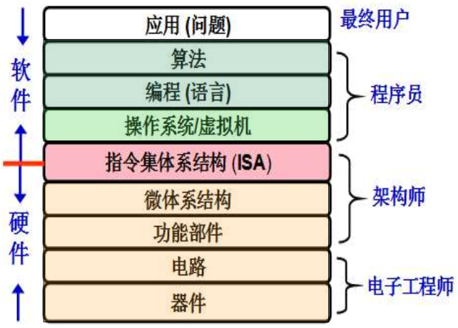

## 计算机系统抽象层的转换

总的来说，计算机系统各抽象层之间的转换就是程序由 编写 → 编译 → 汇编 → 链接 → 启动 → 执行的转换。

> 具体看书上第13页的说明。

## 计算机核心层之间的关联
高级语言翻译为机器代码这一过程需要完成多个步骤，包括
- 词法分析
- 语法分析
- 语义分析
- 中间代码生成、代码优化
- 目标代码生成、目标代码优化
- $......$

整个过程可以分为两个阶段：**前端、后端**。  
前端指的是中间代码生成前的各个步骤，主要完成对源程序的分析，把源程序切分成一些基本块，并用中间语言表示。  
后端在分析结果正确无误的基础上，把中间语言表示转化为目标机器支持的机器级语言程序。

进行语言转换的翻译程序前端必须按照**编程语言标准规范**进行设计，后端应根据** ISA 规范和应用程序二进制接口(Application Binary Interface，ABI) 规范**进行设计。

ISA 规范定义了一台计算机可以执行的所有指令的集合，ABI 是为运行在特定 ISA 和特定操作系统之上的应用程序规定的一种机器级目标代码层接口。

**总结**
- 应用程序需要满足 ISA 规范和 ABI 规范
- 操作系统软件向应用程序提供的运行环境需要满足 ABI 规范，同时，操作系统也也需要根据 ISA 规范来使用硬件提供的接口。
- 在 ISA 层之下的硬件也需要根据 ISA 规范来设计相应的硬件接口，否则不能支撑操作系统和应用程序的正确运行。

> 这也说明了 ISA 层是软硬件之间的桥梁，是计算机系统抽象层次中的关键。

***总之，计算机系统能够按照预期正确工作，是不同层次的多个规范共同相互支撑的结果，计算机系统各抽象层之间如何进行转换，其实都是由这些规范来定义的。***

## 计算机系统的不同用户
> 书上第 16 页到第 18 页。

