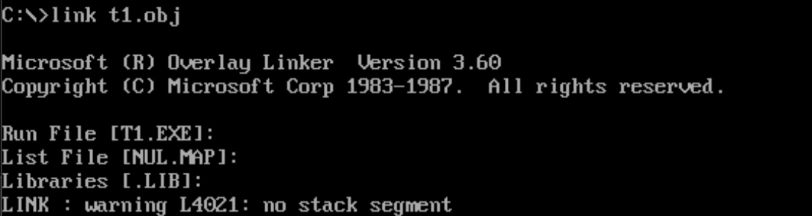

## 一个源程序从写出到执行的过程
1. 写出汇编源程序，产生了一个存储源文件的文本文件。

2. 对源程序进行编译连接
    1. 先用编译器将源文件进行编译，得到目标文件
    2. 再用连接器对目标文件进行连接，得到可执行文件

> 可执行文件包含两个部分：一部分是程序和数据，另一部分是相关的描述信息（比如，程序有多大，要占用多少内存空间）

3. 执行可执行文件
    1. 操作系统依照可执行文件中的**描述信息，将可执行文件中的机器码和数据加载入内存中，并进行相关的初始化**（比如设置CS：IP）
    2. CPU执行程序


## 第一个程序
```asm6502
assume cs:code

code segment
    
    mov ax, 0123h
    mov bx, 0456h
    add ax, bx
    add ax, ax

    mov ax, 4c00h
    int 21h

code ends

end
```
### 伪指令
在汇编语言程序中，包含两种指令
- 汇编指令，可以翻译为机器指令，这个交由CPU进行执行，
- 伪指令，不会翻译为机器指令，由编译器进行执行，编译器会根据伪指令来进行编译。

上面有几类伪指令
1. assume 伪指令

    这条指令假设某一段寄存器和程序中某一个段相关联。在编程的时候，记得用assume来将有特定用途的段和相关的段寄存器关联起来即可。

2. XXX segments ... XXX ends

    段定义伪指令，两条伪指令要成对使用。不仅使程序结构更加清晰，**也能让这一段在编译之后起始地址为16的倍数**（之前我们总说，段这一概念是程序员在编写过程中自己内心想的，但段的起始地址为16的倍数这一条件需要明确，此时就需要用到这一伪指令。）

    一个汇编程序是由多个段组成的，指令、数据、栈被划分到不同的段中。

3. end汇编指令

    end就是一个汇编程序的结束标记，编译器在编译汇编程序的时候，如果碰到了指令end，就结束源程序的编译。

### 指令
指令是源程序中真正会被编译连接生成机器程序的部分，最终会被CPU执行。指令的功能详情看指令总结部分。

### 标号
汇编程序中，我们往往能够见到许多标号，例如这里的code就是一个标号，一个标号指代一个地址。**这里的code在segment前面，作为段的名字，最终被编译、连接程序处理为一个段的段地址。**

### 程序返回
我们可以看到程序最后两条指令。
`mov ax, 4c00h`
`int 21h`
这两条指令实现了程序返回的功能。

在DOS（单任务操作系统）中运行可执行程序的步骤是：一个正在运行的程序P1将P2加载入内存，然后将CPU控制权交给P2，P2才能得以运行，此时P1暂停运行。当P2运行完毕后，应该将CPU的控制权交还给P1，此后，P1继续运行。


## 程序的编译连接与执行
完成对源文件的编辑之后，就会得到一个源文件。我们需要对源文件进行编译和连接之后才能生成可执行文件

### 编译
我们利用masm5.0汇编编译器来进行编译，文件名为masm.exe


我们在命令行中输入masm是调用了masm.exe，后面的t1.asm是我们提供的参数，是masm将要进行编译的文件。

接下来两行告诉我们masm编译器的基本信息

#### 目标文件
*Object filename* 指的是我们要生成的目标文件名称。**在输入文件名的时候一定要指明它所在的路径。**如果文件在当前目录，那么就可以只输入文件名称，如果文件在其他目录，就需要指定目录。后续所有文件名都是如此

这里我们可以看到有[t1.OBJ]，这代表默认生成的目标文件名称为t1，当我们没有进行输入直接回车的时候，就按照默认名称生成目标文件。

#### 列表文件
*Source listing* 指的列表文件。列表文件LST将源程序、目标程序、错误信息进行列表，以供检查程序使用。LST文件是文本文件，可读。

这里默认是[NUL.LST]，也就是并不生成LST文件。

#### 交叉引用文件
*Cross-reference*：包含标识符(段名、过程名、变量名、标号)在源程序中定义的位置和被引用的位置，对源程序所用的各种符号进行前后对照的文件。CRF文件并不是文本文件，不可读。

这里默认是[NUL.CRF]，也就是并不生成CRF文件。

#### 报错信息
最后两行分别是警告信息和报错信息的数量。

#### 汇编过程（两次汇编）
第一次汇编：确定地址，将汇编指令翻译成各条机器码，字符标号原样写出。

第二次汇编：标号代真，将字符标号用计算出的地址值或偏移量代换。


#### 简洁版编译


我们可以直接在`masm 文件`之后直接加上`;`，这样就可以直接以默认的选项跳过先前的几步，直接生成一个与源文件同名的目标文件。

### 连接程序
在对源程序进行了编译得到了目标文件之后，我们需要对目标文件进行连接，从而得到可执行文件。

我们这里用link.exe来对目标文件进行连接。


这里依旧需要注意文件的路径，link.exe在什么路径下面，t1.obj在什么路径下面，生成的文件又想放在什么目录里面。这些都是需要注意的。这里由于已经进入到link.exe所在的目录里面，并且t1.obj也在该目录下，生成的文件也打算放入该目录，因此全部都只是文件名称。

#### 可执行文件名
*Run File* 可执行文件名，默认与目标文件同名

#### 映像文件
*List File* 以.MAP为后缀名，生成可执行文件的中间文件，可以不生成。

#### 库文件
*Libraries* 库文件中包含了一些可以调用的子程序，如果程序中调用了某一个库文件的子程序，就需要在连接的时候，将库文件和目标文件连接起来。我们这个程序没有调用别的子程序，因此可以直接忽略库文件的输入。

#### 连接的作用
- 当源程序很大的时候，可以将它分为**多个源程序文件**来编译，每个源程序编译成为目标文件之后，再用连接程序将它们连接在一起，生成一个可执行文件。
- 程序中**调用了某个库文件的子程序**，需要将这个库文件和该程序生成的目标文件连接在一起生成可执行文件
- 一个源程序编译之后，得到了存有机器码的目标文件，目标文件中有些内容能直接用来生成可执行文件，连接程序将这些内容处理为最终的可执行信息。所以，就算只有一个源文件程序，而又不需要调用某个库中的子程序的情况下，也必须用连接程序对目标文件进行处理，生成可执行文件。


## 程序的执行
我们可以在命令行窗口直接输入可执行文件路径和名称即可。

### shell程序
我们前面提到了，在DOS操作系统中，一个可执行文件的执行，需要靠另一个正在运行的文件将其装载入内存，转移CPU控制权。那么这个正在运行的文件是什么？

这需要先了解DOS的shell程序。操作系统是由多个模块组成的复杂的软件系统。任何通用的操作系统，都要提供一个名为shell的程序，用户使用这个程序来操作计算机系统进行工作。

在DOS操作系统中，有一个程序称为command.com。DOS启动后，先完成其他重要的初始化工作，然后运行command.com，完成其他任务后，在屏幕上显示出由当前盘符和当前路径组成的提示符，然后等待用户的输入。

用户输入可执行文件之后，command将程序加载入内存，设置CPU的CS:IP指向程序的第一条指令（即程序的入口），使程序得以运行。程序运行结束后，返回到“命令解释器”，CPU继续运行command，再次显示出由盘符和路径组成的提示符。

### 可执行文件的装载
**第一步：**找到一段起始地址为SA:0000的容量足够的空闲空间

**第二步：**在这段内存空间中前256字节中，创建一个称为程序段前缀（PSP）的数据区，DOS要利用PSP来和被加载程序通信。

**第三步：**在PSP后面，将程序装入，程序的地址被设置为SA+10H：0，为了更好地区分PSP和程序部分，将两个部分的内存划分到不同的段中（其实就是指段地址不同）

**第四步：**将该内存区的段地址存入ds中（也就是PSP的段地址），设置CS：IP指向程序入口

