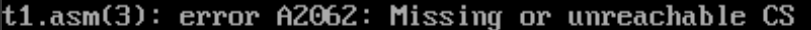
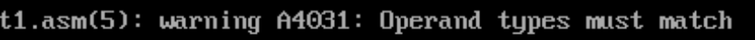
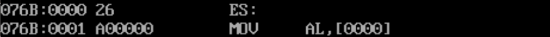

这里主要是我用来总结常见的标号的使用。

## 地址标号
地址标号指代一个地址，常用于转移指令，格式往往是：`标号 :`

**地址标号只有放在代码段中才不会发生编译报错**
```asmatmel
assume ds:data
data segment
  s0: db 'hello world'
data ends
end
```

报错信息


那么编译器根据什么得知这个段是代码段呢？**根据assume伪指令中CS指向的段，而非根据段名**，因此下面的程序不会报错

```asmatmel
assume cs:data
data segment
 s: mov ax, 4c00h
    int 21h
data ends
end
```

### segment伪指令前面的标号
```asmatmel
;定义了一个数据段
data segment
data ends

code segment
    mov ax, data ; 得到data段的段地址
    mov ds, ax
code ends
```

### 转移指令
```asmatmel
;后面的标号指代偏移地址
jmp short 标号
jmp near ptr 标号
;后面的标号指代 段地址 和 偏移地址
jmp far ptr 标号
```
### offset和seg操作符
```asmatmel
offest 标号 ;求出了标号的偏移地址
seg 标号 ;求出了标号的段地址
```


## 数据标号
数据标号往往用来指代一个**数据的起始地址和数据的类型**，格式为：`数据标号 数据类型 数据[,数据2,......]`

举个例子：`hellostring db 'hello world','$'`，这定义了两个事情：
- hellostring指向'hello world'的首地址
- 这个首地址后面的数据是字节型数据

这里的数据类型其实是一个**属性伪操作符**
- db(define byte)
- dw(define word)
- dd(define dword)

### 注意事项
我们可以先看一下数据标号被编译器翻译出来后的汇编指令
```asmatmel
assume cs:code
code segment
    hello db 'hello world', '$'
start:
    mov ax, hello

    mov ax, 4c00h
    int 21h
code ends
end start
```
#### 注意数据标号后的数据的类型
上述代码编译之后会有警告信息


这是因为hellostring后的数据是字节类型，而代码中的ax是16bit寄存器。

#### 注意数据标号所在段的段地址
上面的数据标号定义在了代码段中，对应的寄存器在assume伪指令中指出是CS


用debug对可执行文件进行反汇编之后可以看到：这里的hellostring对应的数据在CS:[0000]处。**这里数据标号的段地址与assume伪指令息息相关。**

假设数据标号在代码中位于data段中，而在assume中data段对应于es寄存器，那么反汇编得到的结果，数据标号的段地址应该存在es中。
```asmatmel
assume cs:code, es:data
data segment
    hellostring db 'hello world'
data ends
code segment
start:
    mov al, hellostring

    mov ax, 4c00h
    int 21h
code ends
end start
```
反汇编结果
